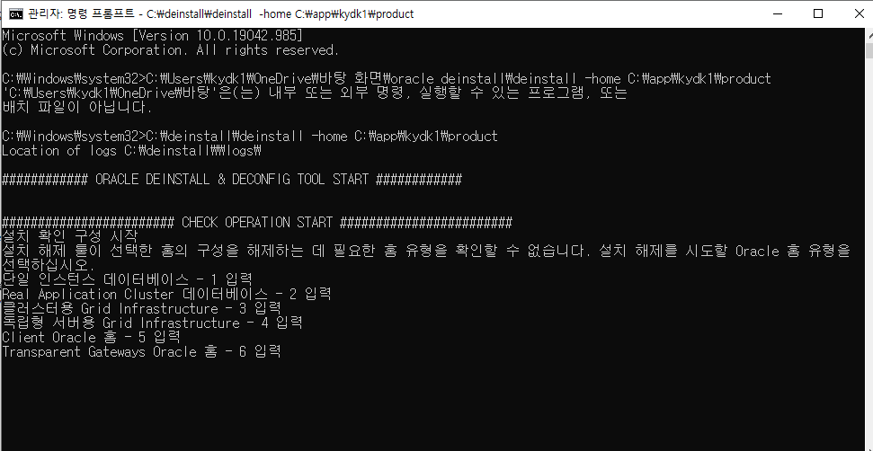
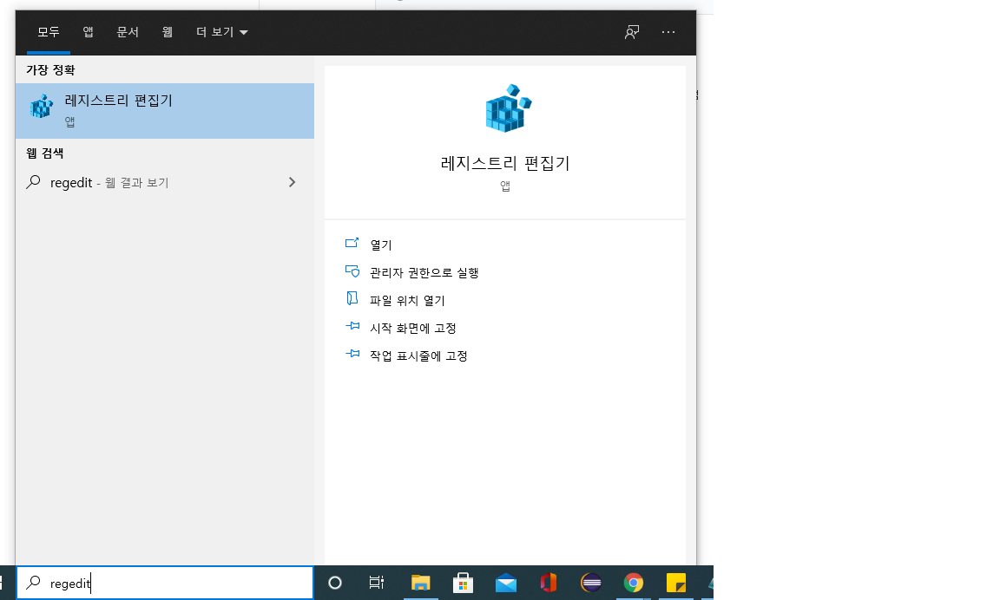
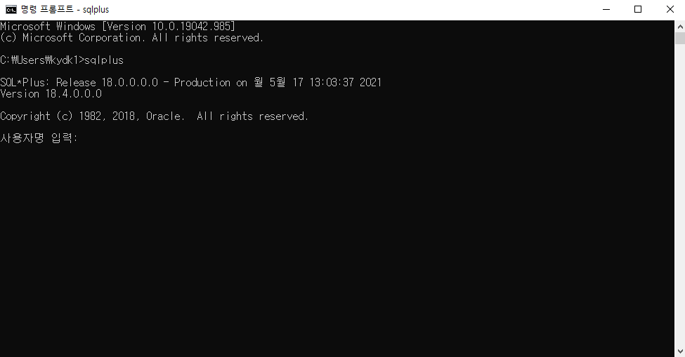

# okta

오라클 클라이언트 변경 
----------
### 11g -> 18ex로 변경
* 오라클 삭제 후 설치
  >1.기존에 설치된 오라클 클라이언트 삭제를 위해 deinstall 없을 시 프로그램   
  >2.cmd를 관리자 권한으로 실행후 deinstall.bat 설치된 경로로 cmd로 실행
  ```
  예시 : C:\deinstall\deinstall -home C:\app\kydk1\product
  ```
  >   
  >3.실행창 - regdit 로 레지스트레 편집기 창 활성화 – HKEY_LOCAL_MACHINE – SOFTWARE – ORACLE을 삭제   
     
  >4.나머지 오라클 파일 삭제 C:\Program Files\Oracle 제거   

  >5.오라클 설치후 cmd - sqlplus로 버전확인   
  
